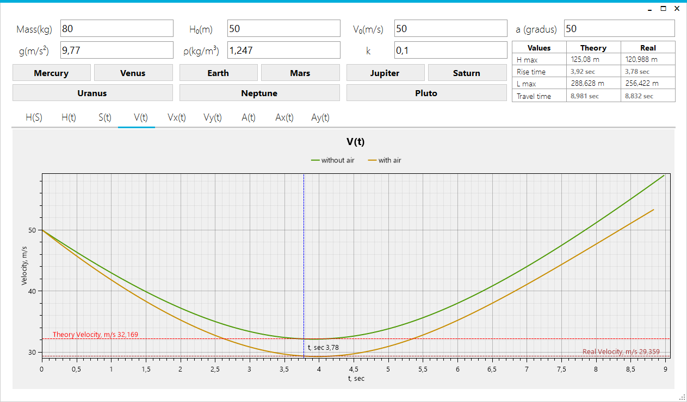
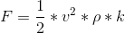

# Physics
  
It's a model body thrown at angle to the horizon taking into account air resistance. Air resistance is calculated according to the formula
  
`k` = Cx * S  
`Cx` - coefficient of resistance  
`S` - the cross-sectional area  
`p` - the density of the air  
`V` - current speed  
You can configure the all values

# Charts
`H(S)` – The trajectory of the body. This chart doesn't have tracker (see below)  
`H(t)` – Height above the ground  
`S(t)` – Distance  
`V(t)` – Velocity  
`Vx(t)` – Velocity along the Xaxis  
`Vy(t)` – Velocity along the Yaxis  
`A(t)` – Acceleration  
`Ax(t)` – Acceleration along the Xaxis  
`Ay(t)` – Acceleration along the Yaxis  

# Zooming and scrolling
All charts have the same viewing range at the time(except the first one) for ease using. To automatically scale press `A` or `Home` in the chart window.  
<b>Scrolling</b> is a LMB and <b>zoom</b> is the mouse wheel.

# Tracker
Also you can see the values of the body parameters in a certain period of time. For this there is a blue time bar which you can LMB to move.

# Planets
In the application there is choice of the planet. When you press on the button, `g` and the `density of the air` set for this planet.

# Table Information
For easely for use there is a basic information. You can set the tracker on the end time or on the rise time of the lifting body. To do this, click on the appropriate label time.
